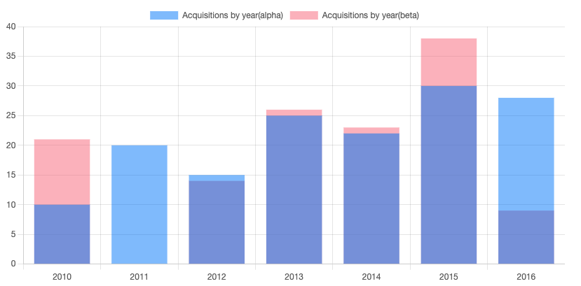

# 20240211

いつもとちょっと趣向が違う．

## 目次

- [20240211](#20240211)
  - [目次](#目次)
  - [今回の TODO](#今回の-todo)
  - [参考資料](#参考資料)
  - [ノート](#ノート)
  - [次回の TODO](#次回の-todo)

## 今回の TODO

1. chart.js でグラフを出力する．
2. 2 値を一つのグラフに出力する．

## 参考資料

1. [Chart.js の導入方法と基本的なオプションの使い方 - 入門ガイド - Qiita](https://qiita.com/benjamin1gou/items/6ec97269aa6778d54dc1)
2. [Step-by-step guide | Chart.js](https://www.chartjs.org/docs/latest/getting-started/usage.html)

## ノート

なんか普段 js 使ってない方が書いてるのかなんなのか、ローカルに chart.js 入れさせるパターンがめちゃくちゃ多い．
普通 npm でインストールしないか？
データ分析の人とか中身はどうでもいい系の人だとそうなるらしい．

[自社開発メガベンチャーをわずか半年で鬱退職した雑魚エンジニアの話](https://zenn.dev/joanofarc/articles/depressied_fired_engineer_on_mega_venture)

[Step-by-step guide | Chart.js](https://www.chartjs.org/docs/latest/getting-started/usage.html)
今回は公式が一番わかりやすい、Parcel という js module bundler を使っている．

成果物、ローカルの chartjs-leaning に入っている．



```js
import Chart from "chart.js/auto";

(async function () {
  const dataAlpha = [
    { year: 2010, count: 10 },
    { year: 2011, count: 20 },
    { year: 2012, count: 15 },
    { year: 2013, count: 25 },
    { year: 2014, count: 22 },
    { year: 2015, count: 30 },
    { year: 2016, count: 28 },
  ];

  const dataBeta = [
    { year: 2010, count: 21 },
    // NaNを用意した．
    { year: 2011, count: NaN },
    { year: 2012, count: 14 },
    { year: 2013, count: 26 },
    { year: 2014, count: 23 },
    { year: 2015, count: 38 },
    { year: 2016, count: 9 },
  ];

  new Chart(document.getElementById("acquisitions"), {
    type: "bar",
    data: {
      // labelにNaNならそう出せるといいんだが、二系あると難しいかもしれない．
      // 結局、リストになっていればいいので、無理くり改行とかしてなんとかしたい．
      labels: dataAlpha.map((row) => row.year),
      datasets: [
        {
          label: "Acquisitions by year(alpha)",
          data: dataAlpha.map((row) => row.count),
          backgroundColor: "rgba(0, 123, 255, 0.5)",
        },
        {
          label: "Acquisitions by year(beta)",
          data: dataBeta.map((row) => row.count),
          backgroundColor: "rgba(255, 99, 132, 0.5)",
        },
      ],
    },
    // ここがポイント
    options: {
      scales: {
        x: {
          stacked: true,
        },
      },
    },
  });
})();
```

単純にデータセットを二つ用意して、bar でチャートを生成する．

ポイント、とコメントしている位置で x 方向のスケールをスタックさせる．

## 次回の TODO

1. [Vite を使って Express.js アプリを作る - 🐾 Nekonote](https://scrapbox.io/dojineko/Vite%E3%82%92%E4%BD%BF%E3%81%A3%E3%81%A6Express.js%E3%82%A2%E3%83%97%E3%83%AA%E3%82%92%E4%BD%9C%E3%82%8B)
